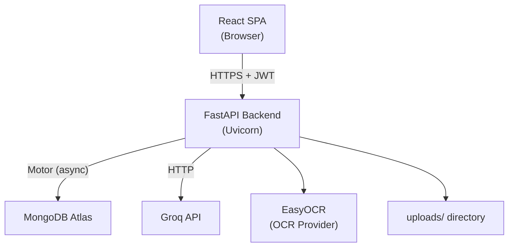
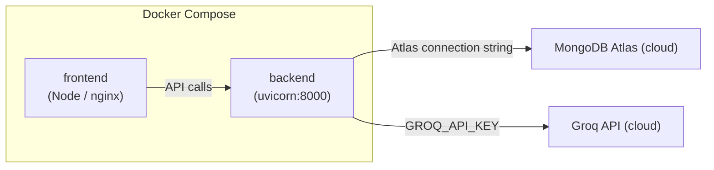
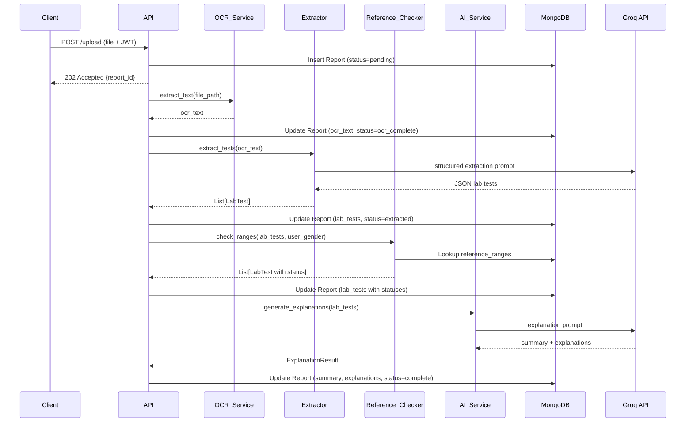

# Design Document: AI Medical Report Analyzer

## Overview

The AI Medical Report Analyzer is a full-stack web application that enables authenticated users to upload lab reports (PDF or image), extract and analyze medical data using OCR and LLM, compare values against reference ranges, and visualize trends over time. The system is strictly educational — it never diagnoses disease or prescribes treatment, and all AI-generated content is accompanied by a medical disclaimer.

The processing pipeline is:

```
Upload → OCR → LLM Extraction → Reference Check → LLM Explanation → Store → Display
```

All pipeline stages are async (Motor + FastAPI background tasks), so the HTTP response returns immediately after file upload while processing continues in the background.

---

## Architecture

### High-Level Architecture



### Deployment Architecture



Docker Compose runs two containers: `frontend` (React build served by nginx) and `backend` (FastAPI + Uvicorn). MongoDB Atlas is a managed cloud service; no local MongoDB container is required.

### Processing Pipeline



---

## Components and Interfaces

### Backend Service Map

```
backend/
  app/
    main.py                  # FastAPI app factory, CORS, router registration
    config.py                # Settings from environment variables (pydantic-settings)
    database.py              # Motor client, collection accessors
    dependencies.py          # get_current_user dependency (JWT decode)
    routers/
      auth.py                # /signup, /login, /profile
      reports.py             # /upload, /reports, /report/{id}, DELETE /report/{id}
      trends.py              # /trends/{test_name}
    services/
      auth_service.py        # Registration, login, JWT issue
      ocr_service.py         # OCR provider interface + EasyOCR implementation
      extractor.py           # LLM-based lab test extraction
      reference_checker.py   # Python arithmetic range comparison
      ai_service.py          # LLM-based plain-language explanation
      report_service.py      # Orchestrates the full pipeline
    models/
      user.py                # Pydantic models for User
      report.py              # Pydantic models for Report, LabTest
      reference_range.py     # Pydantic model for ReferenceRange
```

### OCR Provider Interface

The OCR layer is abstracted behind a Python Protocol so the provider can be swapped (e.g., EasyOCR → Google Vision) without touching business logic.

```python
# app/services/ocr_service.py

from typing import Protocol

class OCRProvider(Protocol):
    def extract_text(self, file_path: str) -> str:
        """Extract text from the file at file_path. Raises OCRError on failure."""
        ...

class EasyOCRProvider:
    def __init__(self):
        import easyocr
        self._reader = easyocr.Reader(['en'], gpu=False)

    def extract_text(self, file_path: str) -> str:
        # PDF → convert pages to images first, then OCR each page
        # JPG/PNG → OCR directly
        ...

# Factory — swap provider here without changing callers
def get_ocr_provider() -> OCRProvider:
    return EasyOCRProvider()
```

PDF pages are converted to PIL images using `pdf2image` before being passed to EasyOCR. The final text is the concatenation of all pages.

### Auth Service

```python
# app/services/auth_service.py

async def register_user(email: str, password: str, gender: str) -> UserInDB
async def authenticate_user(email: str, password: str) -> UserInDB | None
def create_access_token(subject: str, expires_delta: timedelta) -> str
def verify_token(token: str) -> str   # returns user_id or raises HTTPException 401
```

Password hashing uses `bcrypt` via `passlib[bcrypt]`. JWT signing uses `python-jose[cryptography]`.

### Extractor

```python
# app/services/extractor.py

EXTRACTION_SYSTEM_PROMPT = """
You are a medical data extraction assistant.
Extract lab test results from the provided text and return ONLY valid JSON.
Output format: {"tests": [{"test_name": str, "value": float, "unit": str, "reference_range": str}]}
NEVER include disease names, diagnoses, medication names, or treatment recommendations.
NEVER add any text outside the JSON object.
"""

async def extract_tests(ocr_text: str) -> list[LabTest]
```

The Groq client is initialized once from `config.GROQ_API_KEY` and `config.GROQ_MODEL`. The response is parsed with `json.loads` and validated with the `LabTest` Pydantic model. If parsing fails, an `ExtractionError` is raised and the pipeline stops.

### Reference Checker

```python
# app/services/reference_checker.py

async def check_ranges(
    tests: list[LabTest],
    gender: str,   # "male" | "female"
    db: AsyncIOMotorDatabase
) -> list[LabTest]
```

For each `LabTest`:
1. Query `reference_ranges` by `test_name` or any element in the `aliases` array (case-insensitive).
2. Select male or female thresholds based on `gender`.
3. Compare using Python `<` / `>` — no LLM involvement.
4. Set `status` to `"LOW"`, `"NORMAL"`, `"HIGH"`, or `"UNKNOWN"`.

### AI Service

```python
# app/services/ai_service.py

EXPLANATION_SYSTEM_PROMPT = """
You are a medical education assistant helping users understand their lab results.
Provide plain-language educational explanations of what each lab value means.
NEVER diagnose any disease or condition.
NEVER mention medication names, dosages, or treatment plans.
NEVER suggest the user stop or start any medication or supplement.
Always remind users to consult a qualified healthcare professional.
Output ONLY valid JSON: {"summary": str, "explanations": [{"name": str, "explanation": str}]}
"""

async def generate_explanations(tests: list[LabTest]) -> ExplanationResult
```

If the Groq response is empty or unparseable, a fallback `ExplanationResult` with a safe message is returned so the pipeline does not fail.

### Report Service (Orchestrator)

```python
# app/services/report_service.py

async def run_pipeline(report_id: str, file_path: str, user_id: str, gender: str) -> None:
    # 1. OCR
    # 2. Extractor
    # 3. Reference_Checker
    # 4. AI_Service
    # 5. Final MongoDB update
    # Each step updates Report.status in MongoDB
```

This function is launched as a FastAPI `BackgroundTask` after the upload endpoint returns `202 Accepted`.

### Frontend Component Hierarchy

```
src/
  App.tsx                    # Router setup (React Router v6)
  api/
    axios.ts                 # Axios instance with JWT interceptor
    auth.ts                  # login, signup, getProfile
    reports.ts               # uploadReport, getReports, getReport, deleteReport
    trends.ts                # getTrends(test_name)
  contexts/
    AuthContext.tsx           # JWT storage, login/logout helpers
  pages/
    LoginPage.tsx
    SignupPage.tsx
    DashboardPage.tsx
    ReportDetailPage.tsx
    TrendsPage.tsx
  components/
    Navbar.tsx
    ProtectedRoute.tsx        # Redirects to /login if no JWT
    ReportCard.tsx            # Summary card on Dashboard
    LabTestRow.tsx            # Single row in the test table
    TrendChart.tsx            # Chart.js wrapper for one test
    MedicalDisclaimer.tsx     # Persistent disclaimer banner
    StatusBadge.tsx           # Color-coded LOW/NORMAL/HIGH badge
```

---

## Data Models

### MongoDB Collections

#### `users` collection

```json
{
  "_id": "ObjectId",
  "email": "string (unique, indexed)",
  "password_hash": "string (bcrypt)",
  "gender": "string (male | female)",
  "created_at": "ISODate"
}
```

Pydantic models:

```python
class UserCreate(BaseModel):
    email: EmailStr
    password: str = Field(min_length=8)
    gender: Literal["male", "female"]

class UserInDB(BaseModel):
    id: PyObjectId = Field(alias="_id")
    email: EmailStr
    gender: str
    password_hash: str
    created_at: datetime

class UserProfile(BaseModel):
    id: str
    email: EmailStr
    gender: str
    created_at: datetime
    # password_hash intentionally excluded
```

#### `reports` collection

```json
{
  "_id": "ObjectId",
  "user_id": "ObjectId (indexed)",
  "file_name": "string",
  "file_path": "string",
  "uploaded_at": "ISODate (indexed)",
  "status": "string (pending | ocr_complete | extracted | validated | complete | failed_ocr | failed_extraction | failed_explanation)",
  "ocr_text": "string | null",
  "lab_tests": [
    {
      "test_name": "string",
      "value": "float",
      "unit": "string",
      "reference_range": "string",
      "status": "string (LOW | NORMAL | HIGH | UNKNOWN)",
      "explanation": "string | null"
    }
  ],
  "summary": "string | null",
  "error_message": "string | null"
}
```

Pydantic models:

```python
class LabTest(BaseModel):
    test_name: str
    value: float
    unit: str
    reference_range: str
    status: Literal["LOW", "NORMAL", "HIGH", "UNKNOWN"] = "UNKNOWN"
    explanation: str | None = None

class Report(BaseModel):
    id: PyObjectId = Field(alias="_id")
    user_id: PyObjectId
    file_name: str
    file_path: str
    uploaded_at: datetime
    status: str
    ocr_text: str | None = None
    lab_tests: list[LabTest] = []
    summary: str | None = None
    error_message: str | None = None

class ReportSummary(BaseModel):
    """Lightweight model for list endpoints — omits ocr_text and lab_tests."""
    id: str
    file_name: str
    uploaded_at: datetime
    status: str
    summary: str | None = None
```

#### `reference_ranges` collection

```json
{
  "_id": "ObjectId",
  "test_name": "string (unique, indexed)",
  "aliases": ["string"],
  "unit": "string",
  "male_min": "float",
  "male_max": "float",
  "female_min": "float",
  "female_max": "float",
  "description": "string"
}
```

Pydantic model:

```python
class ReferenceRange(BaseModel):
    id: PyObjectId = Field(alias="_id")
    test_name: str
    aliases: list[str] = []
    unit: str
    male_min: float
    male_max: float
    female_min: float
    female_max: float
    description: str
```

Seed data includes at minimum: Hemoglobin, Blood Sugar (Glucose), Vitamin D, Platelets, WBC, RBC, Hematocrit, Creatinine, ALT, AST.

### MongoDB Indexes

```javascript
// users
db.users.createIndex({ email: 1 }, { unique: true })

// reports
db.reports.createIndex({ user_id: 1, uploaded_at: -1 })

// reference_ranges
db.reference_ranges.createIndex({ test_name: 1 }, { unique: true })
db.reference_ranges.createIndex({ aliases: 1 })
```

---

## API Endpoint Design

### Authentication Routes (`/auth`)

| Method | Path | Auth | Description |
|--------|------|------|-------------|
| POST | `/auth/signup` | No | Register new user |
| POST | `/auth/login` | No | Login, receive JWT |
| GET | `/auth/profile` | JWT | Return user profile |

**POST /auth/signup**
```
Request:  { email, password, gender }
Response 201: { message: "User created" }
Response 409: { detail: "Email already registered" }
```

**POST /auth/login**
```
Request:  { email, password }
Response 200: { access_token, token_type: "bearer" }
Response 401: { detail: "Invalid credentials" }
```

**GET /auth/profile**
```
Headers: Authorization: Bearer <token>
Response 200: { id, email, gender, created_at }
Response 401: { detail: "Not authenticated" }
```

### Report Routes

| Method | Path | Auth | Description |
|--------|------|------|-------------|
| POST | `/upload` | JWT | Upload file, trigger pipeline |
| GET | `/reports` | JWT | List user's reports |
| GET | `/report/{id}` | JWT | Get full report detail |
| DELETE | `/report/{id}` | JWT | Delete report + file |
| GET | `/trends/{test_name}` | JWT | Trend data for one test |

**POST /upload**
```
Request:  multipart/form-data { file: File }
Response 202: { report_id, message: "Processing started" }
Response 413: { detail: "File too large" }
Response 422: { detail: "Unsupported file type" }
```

**GET /reports**
```
Response 200: [ ReportSummary, ... ]   (sorted by uploaded_at desc)
```

**GET /report/{id}**
```
Response 200: Report (full document)
Response 403: { detail: "Forbidden" }
Response 404: { detail: "Report not found" }
```

**DELETE /report/{id}**
```
Response 200: { message: "Report deleted" }
Response 403: { detail: "Forbidden" }
Response 404: { detail: "Report not found" }
```

**GET /trends/{test_name}**
```
Response 200: [
  { report_id, uploaded_at, value, unit, status },
  ...
]  (sorted by uploaded_at asc)
```

---

## Error Handling

### Backend Error Strategy

- All services raise typed exceptions (e.g., `OCRError`, `ExtractionError`, `ExplanationError`) that are caught in `report_service.run_pipeline`.
- Each failure sets `Report.status` to the appropriate failed state and stores `Report.error_message`.
- The pipeline is fault-tolerant at the explanation step: if `AI_Service` fails, a fallback explanation is stored and the report is still marked `complete` (with a note about unavailable explanations).
- HTTP layer errors use FastAPI `HTTPException` with appropriate status codes.
- Startup validation: `config.py` uses `pydantic-settings` validators — if required env vars are absent, the app raises `ValidationError` and does not start.

### Pipeline Status Transitions

```
pending
  → ocr_complete     (OCR succeeded)
  → failed_ocr       (OCR failed — pipeline stops)
  → extracted        (Extractor succeeded)
  → failed_extraction (Extractor failed — pipeline stops)
  → validated        (Reference_Checker ran — always succeeds, UNKNOWN for unmatched)
  → complete         (AI_Service ran — fallback used if explanation fails)
  → failed_explanation (reserved for hard failures — currently uses fallback instead)
```

### Frontend Error Handling

- Axios interceptor handles 401 responses globally: clears JWT and redirects to `/login`.
- Component-level error boundaries render user-friendly messages.
- Upload progress shown with a spinner; pipeline status polled via `GET /report/{id}` every 3 seconds until `status === "complete"` or a failed state.

---

## Security Considerations

- Passwords: bcrypt with work factor ≥ 12.
- JWT: signed with HS256, secret from `JWT_SECRET_KEY` env var, configurable expiry (`JWT_EXPIRY_MINUTES`, default 60).
- File uploads: MIME type validated server-side (not just extension); files saved to `uploads/` with a UUID filename to prevent path traversal.
- User isolation: every query against `reports` includes a `user_id` filter; 403 returned for cross-user access attempts.
- Secrets: never logged, never included in API responses. `UserProfile` excludes `password_hash`.
- CORS: configured to allow only the frontend origin in production.
- Production HTTPS: enforced at the reverse proxy / load balancer layer; `Strict-Transport-Security` header recommended.
- LLM safety: system prompts in both `Extractor` and `AI_Service` explicitly prohibit diagnostic/prescriptive content. The `Reference_Checker` is the sole arbiter of LOW/NORMAL/HIGH status.

---

## Docker and Environment Configuration

### Environment Variables

| Variable | Required | Description |
|----------|----------|-------------|
| `MONGODB_URI` | Yes | MongoDB Atlas connection string |
| `JWT_SECRET_KEY` | Yes | Secret for JWT signing |
| `JWT_EXPIRY_MINUTES` | No | JWT TTL in minutes (default: 60) |
| `GROQ_API_KEY` | Yes | Groq API key |
| `GROQ_MODEL` | Yes | Groq model name (e.g., `llama3-8b-8192`) |
| `MAX_UPLOAD_SIZE_MB` | No | Max file size in MB (default: 10) |
| `ALLOWED_ORIGINS` | No | Comma-separated CORS origins |

### docker-compose.yml (outline)

```yaml
version: "3.9"
services:
  backend:
    build: ./backend
    env_file: .env
    ports:
      - "8000:8000"
    volumes:
      - ./uploads:/app/uploads

  frontend:
    build: ./frontend
    ports:
      - "3000:80"
    environment:
      - REACT_APP_API_URL=http://localhost:8000
    depends_on:
      - backend
```

### Backend Dockerfile (outline)

```dockerfile
FROM python:3.11-slim
WORKDIR /app
COPY requirements.txt .
RUN pip install --no-cache-dir -r requirements.txt
COPY . .
CMD ["uvicorn", "app.main:app", "--host", "0.0.0.0", "--port", "8000"]
```

### Frontend Dockerfile (outline)

```dockerfile
FROM node:20-alpine AS build
WORKDIR /app
COPY package*.json ./
RUN npm ci
COPY . .
RUN npm run build

FROM nginx:alpine
COPY --from=build /app/dist /usr/share/nginx/html
COPY nginx.conf /etc/nginx/conf.d/default.conf
```

---

